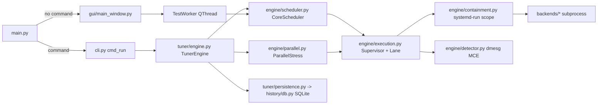

# Repository Guidelines

## Project Overview

CoreCycler is a Linux PySide6/Qt6 desktop app (plus a headless CLI) that stress-tests **one physical core at a time at full single-threaded boost** and tunes AMD PBO **Curve Optimizer** offsets per core via the `ryzen_smu` sysfs mailbox. Its centrepiece is an automatic, crash-safe **tuner** that searches each core's most aggressive stable undervolt.

Safety claims are load-bearing, not marketing. Treat these as invariants when editing:

- CO writes are volatile SMU SRAM overlays. There is no path to BIOS/UEFI NVRAM; a reboot restores stock.
- Stress testing alone writes no CO, voltage, or frequency.
- CO is written in exactly two places: `gui/smu_tab.py` (confirmation dialog, dry-run, backup/restore) and `tuner/engine.py`. They are mutually exclusive; the tab locks while the tuner runs.
- Fail closed. Missing thermal sensor, unreadable forensics, ambiguous core map, or absent cgroup containment must refuse or pause, never proceed optimistically.

## Architecture & Data Flow

`main.py` picks GUI vs headless; both converge on the same execution engine.



Headless call chain: `main:main` -> `cli.cli_main` -> `cmd_run` (QCoreApplication, `QLockFile`, `TunerConfig.validate`, `backends.load_all`, `detect_topology`, `_build_smu`) -> `TunerEngine.start|resume` -> `_run_next` -> `_start_worker` -> `CoreScheduler.run` -> `Supervisor.run` -> `containment.contain` -> `subprocess.Popen`.

Supervisor polling checks, per tick: thermal state, dmesg MCEs, backend live errors, process exit, cgroup placement (escape watchdog), CPU-usage stall, deadline. `StressResult` is the single boundary from external process back into the engine.

**Layering rules:**

- `engine/` never imports `gui/` or `tuner/`. `tuner/` drives `engine/`. `gui/` drives both.
- All external binary lookup goes through `config/tools.py`. PATH alone is unreliable under sudo and tarball installs.
- All CPU affinity enforcement goes through `engine/containment.py`. `taskset` or plain affinity is not an acceptable substitute: a payload can widen its own mask, a cgroup cpuset it cannot. `observed_tree_cpus` is an observation watchdog, not enforcement.
- All persistent path resolution goes through `config/paths.py` (`user_home`, `resolve_work_dir`, `atomic_write`, `fix_sudo_ownership`). Ruff bans `Path.home()` and `os.path.expanduser` repo-wide for exactly this reason: under sudo they resolve to `/root` and fork application state into a second database.

## Key Directories

| Path | Purpose |
|---|---|
| `src/corecycler/engine/` | Stress execution: `execution.py` (Lane/Supervisor/ThermalWatch), `scheduler.py`, `parallel.py`, `containment.py`, `detector.py`, `topology.py`, `backends/` |
| `src/corecycler/tuner/` | CO search state machine: `engine.py` (179 KB, `TunerEngine` + Qt workers), `state.py`, `config.py`, `persistence.py` |
| `src/corecycler/smu/` | `driver.py` (`RyzenSMU` mailbox), `commands.py` (generation command sets, CO encoding), `pmtable.py` |
| `src/corecycler/history/` | `db.py` (WAL SQLite, versioned migrations), `context.py`, `logger.py`, `export.py` |
| `src/corecycler/monitor/` | Read-only sensors: `hwmon.py`, `msr.py`, `power.py`, `frequency.py`, `memory.py`, `cpu_usage.py` |
| `src/corecycler/config/` | `paths.py`, `settings.py`, `tools.py` |
| `src/corecycler/gui/` | One module per tab plus `style.py`, `widgets/` |
| `tests/` | 105 `test_*.py` modules, one `conftest.py` |
| `nix/` | NixOS module and out-of-tree kernel module derivations |
| `scripts/` | Live scenarios and mutation testing |

## Development Commands

```bash
just --list                                     # show recurring workflows
just test                                       # hermetic suite, distributed
just focus tests/test_smu_commands.py           # one target, serial
just gate                                       # lint, formatting, and 100% coverage
just check                                      # build + every repository check
just doctor                                     # tool resolution preflight
```

The dev shell provides `just`; each recipe enters it automatically when needed.
Use `just fmt` to rewrite Python, Nix, and Just formatting. Run `just contract`
or `just live SCENARIO` only on the real hardware they require.

Non-Nix distros: `python3 -m venv .venv && source .venv/bin/activate && pip install -e ".[dev]" && pip install PySide6`, then `pytest tests/ -v`. PySide6 is required by the whole suite, not just GUI tests: autouse fixtures import the tuner engine.

Runtime:

```bash
corecycler                       # GUI
corecycler --version             # installed build, e.g. 0.1.0+g2c5c133
corecycler doctor                # every external tool and how it resolved
corecycler status                # persisted tuner sessions
corecycler tune --config F.json [--seed-from SESSION_ID]  # new or seeded headless tuning
corecycler resume [SESSION_ID]                           # omitted picks an eligible active session
corecycler report [SESSION_ID] [--json]                  # durable result summary
```

There is no `src/corecycler/__main__.py`; `python -m corecycler` is not an entrypoint. `python src/corecycler/main.py` works via the `sys.path` bootstrap in `main.py`.

Flake checks include `default`, `coverage`, `ruff`, `ruff-format`, `nixfmt`, `full-eval`, `python-site-packages`, `module-eval-nixos`, `user-containment`, and `kernel-modules`.

## Code Conventions & Common Patterns

- Python 3.12+, Ruff lint and formatting (`E,F,W,I,UP,B,SIM,TCH,TID251`), 120 columns.
- `from __future__ import annotations` everywhere; built-in generics, `X | None`, `match`, `TYPE_CHECKING` imports to break cycles.
- Type hints on every function signature. State records are `@dataclass(slots=True)`; value objects and topology/backend metadata are `@dataclass(frozen=True, slots=True)`.
- `StrEnum` for domain states so DB and JSON values need no adapters (`TunerPhase`, `StressMode`).
- Comments explain why, never what. Default to zero comments.
- Logging: `logging.getLogger(__name__)` per module. INFO+ to stderr, DEBUG to a rotating `~/.local/share/corecycler/logs/corecycler.log`. Tuner user-facing narrative goes through the `log_message` Qt signal and is persisted as `tuner_events` rows.
- Concurrency is Qt, not asyncio. Long work is a `QThread` (`_TunerWorker`, `_ParallelWorker`, `_RapidTransitionWorker`, `_SoakWorker`, `TestWorker`); stress payloads are `subprocess.Popen`; the APERF/MPERF sampler is a daemon `threading.Thread`. No async/await path exists.
- Seams are constructor parameters, not a DI framework: `TunerEngine` takes db/topology/smu/backend/config/work_dir, `Supervisor` takes a containment function, `cli` takes an optional `engine_factory`.
- Named exceptions are rare and deliberate: `ContainmentUnavailable`, `CoreMapError`. Ordinary environment failures become a classified `StressResult` (`startup`, `computation`, `mce`, `mce_unattributed`, `thermal`, `stall`, `killed`, `crash`, `timeout`, `idle_instability`, `load_transition`, `clock_stretch`, `unknown`) that pauses the tuner instead of advancing its search.
- Display, notification, and optional-sensor failures are caught and logged so they can never change a stability verdict. Hardware-state and containment failures are never swallowed. `tests/test_no_silent_swallow.py` enforces the distinction at the source level.
- State is written before the action it describes: CO journal intent before the SMU write, core/session state before advancing a phase, `in_test` before launching a worker (that row is how a crash gets attributed after reboot).
- Never invent a verdict. Lanes stopped before earning one stay absent; a scheduler kill is pass-like only when no backend error, crash signal, MCE, or external-kill evidence overrides it.
- Adding a backend: new module in `engine/backends/`, subclass `StressBackend` with `get_command`/`parse_output`/`get_supported_modes`, decorate `@register_backend`, add it to `load_all` in `backends/__init__.py`, and add a matching `ExternalTool` to `config/tools.py`. GUI combos derive from the registry, so no GUI edits are needed.
- Commits are Conventional with a scope: `feat(hwmon):`, `fix(smu):`, `test(tuner):`, `docs:`. Scopes in use: `tuner`, `smu`, `gui`, `engine`, `backends`, `history`, `topology`, `tests`, `ci`, `nix`.
- Nix: `nixfmt`, `lib.mkOption` rather than `with lib;`.
- Aim for 100% line coverage. Use `# pragma: no cover  # reason: <why>` only for code that cannot meaningfully be exercised; a reason is required and must not hide testable behavior.
- Temporary overlays must export `meta.reason`, `meta.added` (`YYYY-MM-DD`), `overlay`, and exactly one of `dropWhen`/`dropWhenBuilds` testing the real condition.

## Important Files

- `src/corecycler/main.py` - process bootstrap, logging, `QLockFile` single-instance, sudo session recovery, signal handlers, `sys.excepthook`/`threading.excepthook`.
- `src/corecycler/cli.py` - headless dispatch and exit-code mapping.
- `src/corecycler/tuner/engine.py` - the state machine; `_run_next`, `_on_test_finished`, `_advance_core`, `_run_validation_next`, `resume`.
- `docs/tuner-state-spec.md` - **normative** per-core transition table and crash-attribution priority. `tests/test_state_transition_spec.py` executes it.
- `docs/test-order-spec.md` - **normative** scheduler selection contract for all five orders. `tests/test_test_order_spec.py` executes it.
- `docs/architecture.md` - layer map and containment contract.
- `CONTEXT.md` - the domain glossary; use its terms in names, messages, docs and tests. `docs/adr/` records the decisions that are hard to reverse.
- `pyproject.toml` - Ruff rules, the `TID251` path bans, pytest markers, coverage config.
- `flake.nix` - package variants (`default` FOSS, `full` unfree with mprime/y-cruncher), the pytest gate, standalone coverage and repository checks.

## Runtime/Tooling Preferences

- The Nix devshell is the intended environment; `.envrc` is `use flake` under direnv. Do not pin the Nix build to `python312`: it deliberately uses nixpkgs' default `python3` for PySide6 binary-cache hits while `pyproject.toml` stays `>=3.12`-compatible.
- Version is git-derived (setuptools-scm); there is no per-commit literal to bump. `[tool.setuptools_scm].fallback_version` in `pyproject.toml` is the release line, bumped only when cutting a tag. The Nix sandbox has no `.git`, so `flake.nix` builds `<fallback_version>+g<rev>` and feeds it to both the derivation and `SETUPTOOLS_SCM_PRETEND_VERSION`; a git checkout reports `<next>.devN+g<rev>` instead. `corecycler.__version__` falls back to `0+unknown` in an uninstalled checkout and is stamped on every `tuner_sessions` row.
- Required at runtime: `systemd-run` and `setpriv` (containment refuses to launch without them) plus at least one stress backend. `corecycler doctor` is the preflight and fails on exactly that set.
- Tool resolution order is `CORECYCLER_<TOOL>_BIN` -> `~/.config/corecycler/tool-paths.json` -> `PATH`. An explicit non-executable path is rejected rather than falling back. Discovery only suggests candidates; it never executes an unrecorded binary.
- State locations: settings `~/.config/corecycler/settings.json`, tool paths `~/.config/corecycler/tool-paths.json`, history `~/.local/share/corecycler/history/history.db`, logs `~/.local/share/corecycler/logs/`, lock `~/.local/share/corecycler/corecycler.lock`, work dir `$XDG_RUNTIME_DIR/corecycler/work` when owned by the invoking UID, else `~/.cache/corecycler/work`.
- CO tuning additionally needs a loaded `ryzen_smu`, a writable `/sys/kernel/ryzen_smu_drv/smu_args`, a supported generation, and an unambiguous core map. `MSRReader` needs `/dev/cpu/N/msr` and is read-only; it never writes MSRs.
- Do not remove the mprime prepare/cleanup path. Without `local.txt`/`prime.txt` mprime self-pins its workers, and a stale `results.txt` silently fails the next run.

## Testing & QA

pytest (`pythonpath = ["src"]`, `testpaths = ["tests"]`) with Hypothesis. Markers: `slow`, `hardware`, `contract`. Register new markers in `pyproject.toml`.

`addopts` in `pyproject.toml` is `-n auto --dist worksteal`: the hermetic gate is ~3200 short tests and process fan-out is the only knob that matters (82s serial, ~15s parallel on 16 threads). Three consequences. Any run that touches real hardware, real stress binaries, or wall-clock budgets - `-m slow`, `-m contract`, `scripts/live_scenarios.py` - MUST pass `-n0`, because 16 workers competing for cores invalidate every timing assumption. `-n0` is also what you want for `pdb` and `-s`. And a new hermetic test that shells out and waits on a real child must size its deadline for a fully loaded box, not an idle one.

While iterating, run the focused module or class rather than the whole gate, always with `-n0` - worker startup costs more than a few hundred short tests. Run the full gate before handing work back, not on every edit.

Test-driven development is required for every behavior change. Follow the cycle in order:

1. **Red:** Before editing production code, add or change the smallest test that expresses the desired observable behavior. Run that test and confirm it fails for the expected reason; an unrelated failure or an immediately passing test does not establish the red step.
2. **Green:** Make the smallest production change that satisfies the test, then rerun the targeted test until it passes.
3. **Refactor:** Improve the production and test code without changing behavior, keeping the targeted test green, then run the relevant broader gate.

Every bug fix starts with a regression test that reproduces the bug. Exercise hardware-dependent behavior through the existing hermetic seams; put external assumptions in the Ring A and Ring B contract tests. Documentation-only, comment-only, and formatting-only changes are exempt because they do not change behavior.

```bash
just cov
just focus tests/test_smu_commands.py -v
just focus tests/test_smu_commands.py::TestCoEncoding -v
just contract
just contract-privileged
just mutate --src src/corecycler/smu/commands.py --tests tests/test_smu_commands.py --max 60
```

**Coverage floor is 100% line coverage** for the non-slow suite, enforced by `checks.coverage` (`--cov-fail-under=100`, `branch = false`, `*/main.py` omitted). New code should have tests. When coverage is not meaningful, use `# pragma: no cover  # reason: <why>` and explain the unreachable or unobservable path. The guard test rejects bare exemptions.

Three rings:

- **Hermetic** (the normal gate): `tmp_path`, in-memory `HistoryDB`, dictionary-backed fake sysfs, fake SMU mailboxes, scripted supervisors, patched `subprocess`. No test may depend on the host CPU, `/proc`, `/sys`, `/dev/cpu`, the kernel journal, installed tools, or real SMU writes.
- **Ring A**: constant pins in `tests/test_contracts.py` driven by `tests/contract_inventory.py`. Runs in the normal gate.
- **Ring B**: `@pytest.mark.contract` (usually plus `slow`), real binaries and hardware. `tests/_contract_hw.py` makes an absent resource skip normally but **fail** under `CORECYCLER_HW_CONTRACTS=1`. A meta-test requires every live-verifiable inventory entry to name its Ring B test, so a new external assumption needs an inventory entry, a Ring A pin, and a Ring B test. Ring B is **opt-in** through the single explicit `CORECYCLER_HW_CONTRACTS=1` switch; marker and keyword expressions such as `-m contract` and `-k contract` only select tests and never disable hermetic isolation.

What the hermetic tier is structurally prevented from touching, all set up in `tests/conftest.py` and asserted by `tests/test_hermeticity.py`:

- **The network.** The autouse `no_network` fixture turns `socket.connect`, `connect_ex`, `create_connection` and `getaddrinfo` into a `RuntimeError`. AF_UNIX stays open for local IPC. Nothing in corecycler talks to a remote host, so any hit is a mock that fell through.
- **The user's home.** Before the first corecycler import, conftest points `HOME` and every `XDG_*` at a throwaway under the system temp dir, removed at session finish. This has to happen at import: `history.db.DATA_DIR` is a module constant built from `user_home()`. The suite used to create `~/.local/share/corecycler`.
- **The desktop.** `QT_QPA_PLATFORM=offscreen` is forced for the same reason: the GUI tests were driving the real compositor, and the clipboard tests overwrote whatever the developer had copied.
- Ring B keeps the real home, runtime, and desktop because containment requires the real systemd user manager. The autouse network guard still blocks network access.

What remains deliberately live in the hermetic tier, because the behavior under test *is* the OS: short-lived local child processes (`python -c` sleepers and busy loops) in `test_duty_cycle.py`, `test_execution.py`, `test_engine_edges.py` and `test_inhibit.py`, which exercise real `SIGSTOP`/`SIGCONT`, process-group kills and reaping. They spawn nothing outside the test's own process tree and write nothing outside `tmp_path`. Mocking them away would delete the only proof those paths work.

`tests/conftest.py` is the only conftest. Key fixtures: `topo_9950x3d2`/`topo_dual_ccd_x3d`/`topo_single_ccd`/`topo_intel`, `build_topology`, `mock_sysfs`, `mock_backend`, `mock_ryzen_smu_sysfs`, `zen3_commands`/`zen5_commands`, `db`, `exec_tmp_path` (falls back off a `noexec` `/tmp`), `on_path`. Autouse: `no_network`, `tool_search_roots` (strips every `CORECYCLER_*_BIN`), `no_real_sleep_inhibitor`, `no_real_freeze_monitor`, `no_desktop_notifications`, `no_blocking_dialogs` (any modal raises with the name of the helper to patch), `assume_rebooted`, `no_real_forensics`, `assume_clean_shutdown`.

Conventions and gotchas:

- Assert observable behavior and safety outcomes, not implementation. Three source-level guards already exist: `test_no_duplicate_functions.py`, `test_no_silent_swallow.py`, `test_packaging.py`.
- Tuner fault tests patch `QTimer.singleShot` to run synchronously; worker tests call `run()` directly. A new hermetic test must not start a real `QThread` or a real stress binary.
- GUI test modules skip themselves when `PySide6` has no `__path__`, which is how they detect the conftest's minimal Qt fallback. They reuse `QApplication.instance() or QApplication([])`.
- Avoid `sleep` in hermetic tests: patch timing, use events, or use a scripted supervisor. Real sleeps belong only to the short timing tests in `test_scheduler.py`/`test_execution.py` and to Ring B.
- Most Hypothesis properties set `deadline=None` because they drive state machines, Qt, or file-backed doubles. There is no registered Hypothesis profile.
- `scripts/live_scenarios.py` and `scripts/run_live_scenario.sh` drive the real GUI against real hardware with a required isolated `--home`. The wrapper aborts if any stress backend or another campaign is running and terminates only its own process group.
